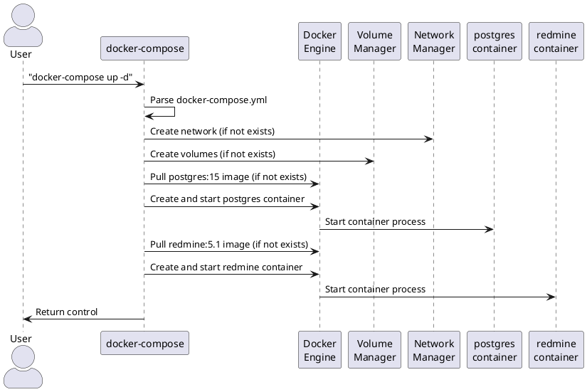

```plantuml
@startuml
skinparam actorStyle awesome

actor User as user
participant "docker-compose" as Compose
participant "Docker\nEngine" as Docker
participant "Volume\nManager" as Volume
participant "Network\nManager" as Network
participant "postgres\ncontainer" as Postgres
participant "redmine\ncontainer" as Redmine

user -> Compose : "docker-compose up -d"
Compose -> Compose : Parse docker-compose.yml
Compose -> Network : Create network (if not exists)
Compose -> Volume : Create volumes (if not exists)
Compose -> Docker : Pull postgres:15 image (if not exists)
Compose -> Docker : Create and start postgres container
Docker -> Postgres : Start container process
Compose -> Docker : Pull redmine:5.1 image (if not exists)
Compose -> Docker : Create and start redmine container
Docker -> Redmine : Start container process
Compose -> user : Return control
@enduml
```
